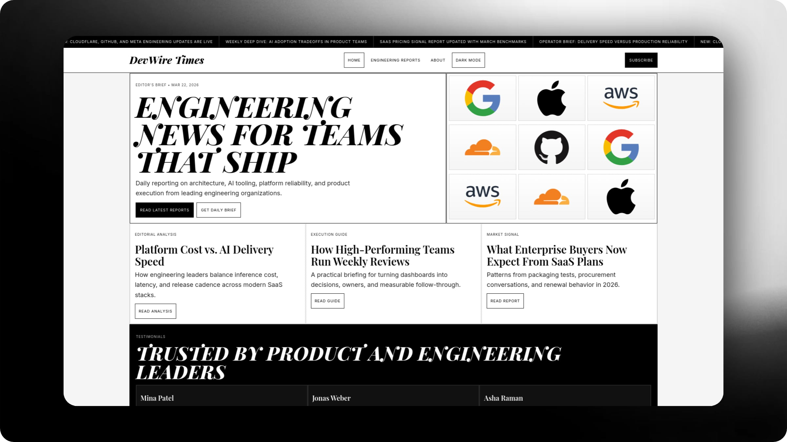

# DevWire Times

DevWire Times is an open-source engineering news and editorial platform built for product and engineering teams that need fast, practical technical context.

It combines:
- Curated external engineering news
- Internal long-form editorial reports
- Search and category filtering
- RSS distribution
- Newsletter subscription collection

## Product Purpose

DevWire helps teams stay current on modern engineering topics without spending hours across scattered sources.

The platform focuses on:
- Actionable insights over hype
- Operationally useful reporting
- Consistent publishing experience for teams

## Core Features

- Newsroom homepage with featured stories and editorial layout
- Engineering feed stream from trusted sources
- Category and source filtering
- Search across report metadata and content
- Internal editorial blog section backed by D1
- Blog detail pages with long-form article content
- RSS feed for syndication and reader apps
- Newsletter subscription endpoint and frontend form flow
- SEO metadata (canonical links, Open Graph, Twitter cards, JSON-LD)
- Responsive UI and theme support

## Tech Stack

- Framework: Astro
- Runtime and Hosting: Cloudflare Workers
- Database: Cloudflare D1 (SQLite)
- API Layer: Hono
- ORM: Drizzle ORM
- Styling: Tailwind CSS
- Syndication: RSS
- Language and Tooling: TypeScript with Bun

## Intended Users

- Engineering leaders tracking platform and delivery trends
- Product managers monitoring technical market signals
- Frontend/backend teams looking for practical implementation patterns
- Developer advocacy/editorial teams publishing internal reports

## Typical Uses

- Daily engineering news review
- Weekly technical briefings
- Internal knowledge sharing and editorial publishing
- Team onboarding into architecture and delivery practices
- External audience growth via RSS and newsletters

## Frontend Experience

- Home: branded landing + featured briefings
- Blog: combined external news + internal editorial reports
- Report detail: full read experience for internal long-form posts
- About: product positioning and publication context

## Reliability and Launch Readiness

Current implementation includes:
- Production deployment on Cloudflare Workers
- D1-backed server rendering paths

## Security and Privacy

- No secrets are stored in repository content
- Environment bindings are resolved at runtime
- Newsletter endpoint validates input before persistence
- Sensitive values should remain in deployment secret storage only

## Notes

- Keep editorial content quality high with clear, specific, and operationally useful writing.
- Internal blog articles are designed for long-form depth and practical guidance.
